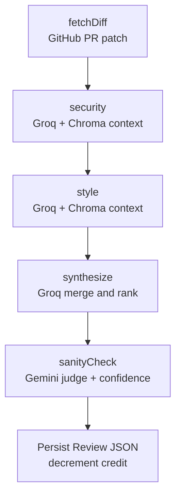

# PullSentry


**Catch risky pull requests before they land.**


## Table of contents

- [Overview](#overview)
- [How it works](#how-it-works)
- [Features](#features)
- [Tech stack](#tech-stack)
- [Architecture](#architecture)
- [Getting started](#getting-started)
- [Contributing](#contributing)
- [Roadmap](#roadmap)
- [License](#license)


## Overview

Reviewing pull requests takes more time as teams ship both human-written and AI-generated code. Generic linters and one-shot LLM comments rarely know how *this* repository names things, handles errors, or guards auth. They either miss real issues or flood the diff with noise.

PullSentry is a GitHub-only PR review app that grounds findings in the repo you actually ship. After you connect a repository and index its source, a LangGraph pipeline fetches the PR diff, retrieves similar code from a Chroma vector index, and runs dedicated security and style agents (Groq). A synthesis step merges those results; Gemini then sanity-checks the list and assigns a confidence score to each finding.

The product is a Vite React client and an Express API, with Clerk for auth, PostgreSQL (typically Neon) via Prisma, and Sentry on the server for error tracing.

## How it works

1. **Sign in** with Google or GitHub (Clerk). If you signed in with Google, link GitHub from the dashboard so PullSentry can list your repositories.
2. **Connect a GitHub repo** from the browse list. Octokit uses the GitHub OAuth token Clerk stores for your account.
3. **Index the codebase** from the repo Settings tab. Source files are chunked, embedded locally (`Xenova/all-MiniLM-L6-v2`), and stored in Chroma (`repo-{id}` collections).
4. **Review a pull request.** The API spends one review credit, runs the LangGraph graph, and persists findings.
5. **Read the results** on the Pull Requests tab and the Security tab: severity, file, line, description, and Gemini confidence when the judge returns a score.

GitHub is the only supported VCS. There is no GitLab or Bitbucket integration.

## Features

- **Clerk authentication** — Google and GitHub on the sign-in page; GitHub can be linked later for Google-first accounts.
- **GitHub repository connection** — list repos and open PRs through Octokit; connect, disconnect, and open a repo detail view.
- **RAG indexing** — Chroma vector store plus Hugging Face Transformers embeddings; re-index replaces the previous collection for that repo.
- **LangGraph multi-agent review** — sequential graph: fetch diff → security agent → style agent → synthesize → Gemini judge.
- **Grounded findings** — security and style nodes retrieve similar snippets from the index before calling Groq (`openai/gpt-oss-120b`).
- **Confidence scoring** — Gemini (`gemini-3.6-flash`) drops false positives, may add obvious misses, and scores each finding from 0–1.
- **Review credits** — new users start with 10 credits; each successful review decrements one. The UI disables Review at zero and shows a tooltip plus toast.
- **Rate limiting** — connect, disconnect, index, and review are limited to 20 requests per 15 minutes per Clerk user (IP if unauthenticated).
- **Toasts** — Sonner notifications for success, errors, rate limits, and credit warnings (not inline alerts).

Dark mode is **not** a product feature. Token files include a `.dark` block, but the app forces `color-scheme: light` and the toaster is `theme="light"` with no theme switcher.

## Tech stack

**Frontend**

- React 19, Vite, React Router
- Tailwind CSS 4, shadcn/ui (Base UI primitives)
- Clerk React (`@clerk/react`, `@clerk/ui`)
- Sonner toasts

**Backend**

- Node.js, Express 5 (ESM)
- Prisma 7 with the PostgreSQL driver adapter (`pg`)
- Octokit
- `express-rate-limit`

**Database**

- PostgreSQL (Neon in the default setup)

**AI / ML**

- Groq — `openai/gpt-oss-120b` (security, style, synthesis)
- Google Gemini — `gemini-3.6-flash` (judge / confidence)
- LangChain.js, LangGraph.js
- Chroma (vector store)
- `@huggingface/transformers` — `Xenova/all-MiniLM-L6-v2` embeddings (local, no Hugging Face API key)

**Auth**

- Clerk (session JWT to the API; GitHub OAuth token via Clerk Backend API)

**Monitoring**

- Sentry for Node (`@sentry/node`) — optional DSN; spans around review graph steps


## Architecture

Reviews run as a compiled LangGraph `StateGraph`. Security and style are **sequential**, not parallel: each node loads RAG context from Chroma using added lines from the diff as the search query, then Groq returns a JSON array of findings. Synthesis merges those lists (or falls back to concatenation if the merge is empty). The Gemini node is the last pass.




Credits are decremented in the same transaction that writes the `Review` row; if persistence fails after the LLM run, the credit is incremented back.

The Vite dev server proxies `/api` to the Express app (`localhost:3001`). The API binds `0.0.0.0` and uses `PORT` or **3001**. Routes are versioned under `/api/v1`. Chroma defaults to **8000**.

## Getting started


### Prerequisites

- **Node.js 20+** (the API uses `--experimental-strip-types`)
- **npm** (this is an npm workspaces monorepo: `client/` and `server/`)
- A **Clerk** application with **Google** and **GitHub** SSO enabled. GitHub access for listing repos comes from Clerk’s GitHub connection (development instances can use Clerk’s shared OAuth credentials; production typically uses your own GitHub OAuth app in the Clerk dashboard).
- **PostgreSQL** (Neon or local), with a connection string Prisma can reach
- **Groq** API key
- **Gemini** API key (`GEMINI_API_KEY` or `GOOGLE_API_KEY`)
- **Chroma** running locally (`npm run chroma` from the repo root)
- **Sentry** DSN — optional; omit or leave placeholder if you are not sending events


### Groq and Gemini keys (no card)

Groq and Google AI Studio both issue free API keys without a credit card for typical hobby/dev usage. Create keys at [Groq Console](https://console.groq.com/) and [Google AI Studio](https://aistudio.google.com/). Free tiers have rate limits; if a review fails with a provider error, wait and retry.

### Install

```bash
git clone https://github.com/Sad7920/pull-sentry.git
cd pull-sentry
npm install
```

Copy env templates (never commit real secrets):

```bash
cp client/.env.example client/.env
cp server/.env.example server/.env
```


### Environment variables

`client/.env`


| Variable                                   | Purpose                                           |
| ------------------------------------------ | ------------------------------------------------- |
| `VITE_CLERK_PUBLISHABLE_KEY`               | Clerk publishable key for the Vite app            |
| `VITE_CLERK_SIGN_IN_URL`                   | Sign-in path (`/login`)                           |
| `VITE_CLERK_SIGN_UP_FALLBACK_REDIRECT_URL` | Where new users land after sign-up (`/dashboard`) |


`server/.env`


| Variable                | Purpose                                                            |
| ----------------------- | ------------------------------------------------------------------ |
| `DATABASE_URL`          | PostgreSQL connection string (required)                            |
| `CLERK_PUBLISHABLE_KEY` | Clerk publishable key (required)                                   |
| `CLERK_SECRET_KEY`      | Clerk secret key (required)                                        |
| `GROQ_API_KEY`          | Groq key for review agents (required)                              |
| `GEMINI_API_KEY`        | Gemini key for the judge (required unless `GOOGLE_API_KEY` is set) |
| `GOOGLE_API_KEY`        | Alternate Gemini key name                                          |
| `CHROMA_URL`            | Chroma HTTP URL (defaults to `http://localhost:8000`)              |
| `SENTRY_DSN`            | Sentry DSN for the API (optional)                                  |
| `PORT`                  | API port (defaults to `3001`)                                      |
| `NODE_ENV`              | Used for Sentry sample rates                                       |


In Clerk, set the allowed origins / redirect URLs for `http://localhost:5173` and enable GitHub scopes that can list the user’s repositories (`read:user`, `user:email`, and `repo` if you need private repos).

### Database

From `server/`:

```bash
cd server
npx prisma migrate deploy
npx prisma generate
```

`npm run prisma:migrate -w server` runs `prisma migrate dev` (local development, may prompt for a migration name).

### Run locally

From the repo root, start API (with file watcher), Vite, and Chroma together:

```bash
npm run dev
```

- Client: [http://localhost:5173](http://localhost:5173)
- API: [http://localhost:3001](http://localhost:3001) (`GET /api/v1/health` → `{ "status": "ok" }`)
- Chroma: [http://localhost:8000](http://localhost:8000)

On macOS, if the API watcher fails with too many open files, raise the limit and start the API without `--watch`:

```bash
ulimit -n 10240
npm run start -w server
npm run dev -w client
npm run chroma
```

First index download of `Xenova/all-MiniLM-L6-v2` can take a minute. Chroma data is stored under `./chroma_data` (gitignored).

## Contributing

Issues and pull requests are welcome — whether you are fixing a bug, tightening docs, or improving review quality.

See **[CONTRIBUTING.md](./CONTRIBUTING.md)** for setup reminders, PR expectations, and how we handle schema changes.

Be respectful in issues and reviews. Harassment and personal attacks are not acceptable.

## Roadmap

Not implemented today, and not implied by the current UI:

- Paid plans or an upgrade checkout (credits are a fixed per-user balance in Postgres)
- Additional VCS providers
- User-facing dark mode
- Client-side Sentry


### Production hardening

- [ ] **Eval harness** — Golden dataset of labeled PRs (known correct/incorrect findings) run through the LangGraph pipeline (including Chroma-retrieved context) on every prompt or Groq/Gemini model change, tracking precision, recall, and false-positive rate over time.
- [ ] **Cost tracking & budget guardrails** — Per-request token usage and cost logged by model (Groq vs Gemini), a summary view, and a circuit breaker that falls back to a cheaper model or rejects reviews that exceed a cost threshold.
- [ ] **Prompt/output testing in CI** — A suite (promptfoo or a custom harness) asserting on JSON structure and content from the security, style, and synthesis Groq nodes, wired into CI so prompt changes cannot merge if they break existing cases.
- [ ] **Reliability improvements** — Exponential backoff and retry for Groq/Gemini timeouts and rate limits, plus routing low-confidence Gemini judge findings to a human-review queue instead of auto-persisting them; failures stay visible in the existing Sentry review spans.


## License

This project is licensed under the [MIT License](./LICENSE).